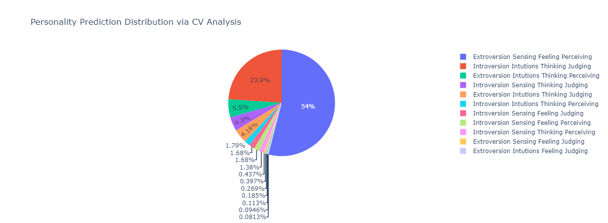

# Personality Prediction System via CV Analysis

This project focuses on predicting personality types using the Myers-Briggs Type Indicator (MBTI) framework through the utilization of Cross-Validation (CV) techniques.

Data used is from Kaggle [MBTI Data](https://www.kaggle.com/datasets/datasnaek/mbti-type) & [Meta Kaggle Data](https://www.kaggle.com/datasets/kaggle/meta-kaggle?select=Users.csv) 
 * mbti_1.csv 
 * Users.csv
 * ForumMessages.csv

## The Myers-Briggs Type Indicator (MBTI)

The Myers-Briggs Type Indicator (MBTI) is a psychological assessment tool used to classify people into one of 16 different personality types. The classification system consists of a four-letter code based on four dimensions, where each letter in the code refers to the predominant trait in each dimension. The four dimensions are:

Mind: Introverted (I) or Extraverted (E) which describes the different attitudes people use to direct their energy (i.e. the "inner world" vs. one's "outer world").

Energy: Sensing (S) or Intuitive (N) which describes people's method of processing informaton (i.e. paying more attention to the patterns and possibilities seen in the information received vs. information that comes in through the five senses)

Nature: Feeling (F) or Thinking (T) which describes people's method for making decisions (i.e. putting more weight on objective principles and impersonal facts vs. personal concerns and the people involved).

Tactics: Perceiving (P) or Judging (J) which describes people's orientation to the outside world and the behaviors one exhibits (i.e. preferring a structured and decided lifestyle vs. a more flexible and adaptive lifestyle)

The letters associated with an individual's preferences are combined to get the Myers Briggs personality type.

So as a result we have 16 personality types: ESTJ, ENTJ, ESFJ, ENFJ, ISTJ, ISFJ, INTJ, INFJ, ESTP, ESFP, ENTP, ENFP, ISTP, ISFP, INTP & INFP.

## CV: Cross-validation

Cross-validation (CV) is a technique used to assess the performance of a machine learning model on unseen data. It involves splitting the dataset into multiple subsets (folds), training the model on a portion of the data, and evaluating it on the remaining portion. This process is repeated several times with different combinations of training and evaluation sets. The results are then averaged to provide a more reliable estimate of the model's performance.

## Result

